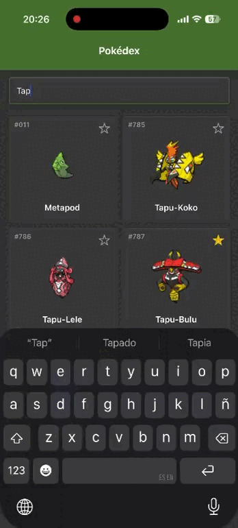
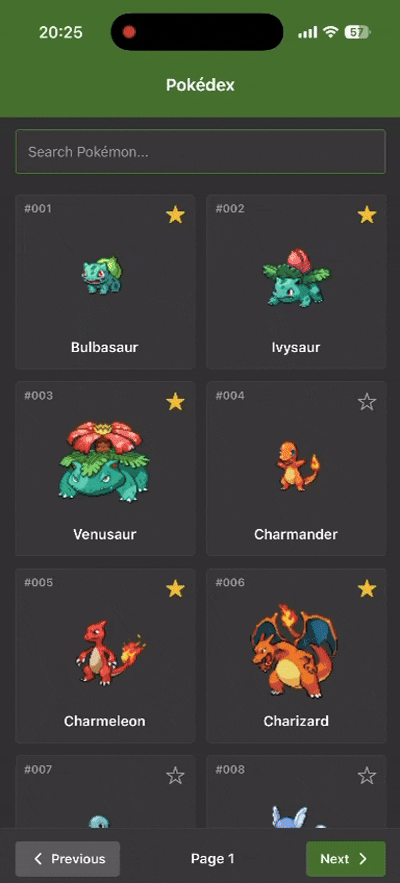
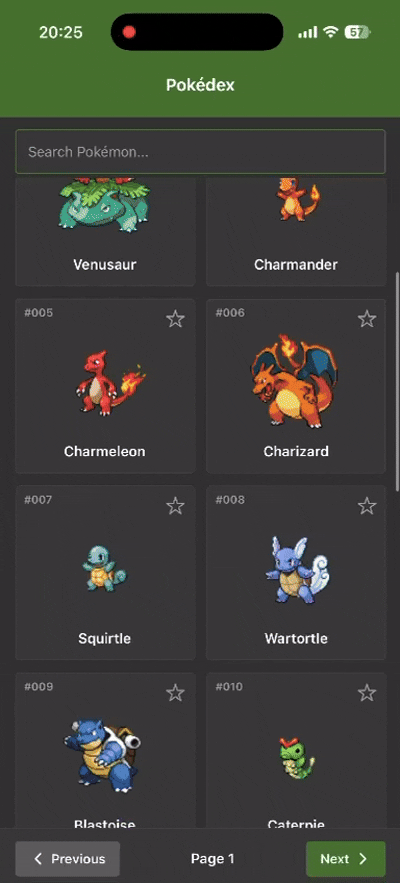
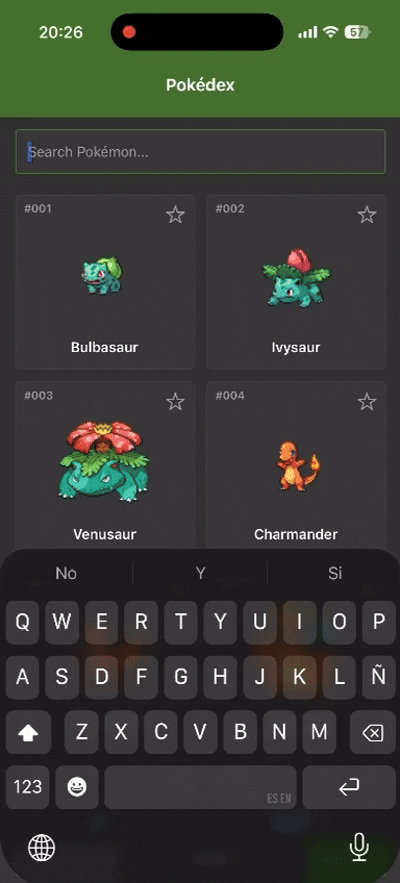

# Poké-App-Dex

Pokédex construida con React Native + TypeScript, consumiendo [PokeAPI](https://pokeapi.co/). 

## Instalación y ejecución

### Requisitos previos

- Node.js 18+ y npm.
- Un dispositivo/emulador Android, simulador iOS, o [Expo Go](https://expo.dev/go) en un celular físico.

### Pasos

```bash
# 1. Instalar dependencias
npm install

# 2. Levantar el servidor de desarrollo
npx expo start
```

Desde la terminal que abre `expo start` puedes:

- Presionar `a` para abrirlo en un emulador Android, o `i` para iOS (requiere Android Studio / Xcode instalado).
- Escanear el código QR con la app **Expo Go** en un celular físico.
- Presionar `w` para correrlo en el navegador.

### Correr los tests

```bash
npm test
```
Corre la suite de Jest (`jest-expo`)
### Decisiones técnicas principales


## Librerías principales

| Librería | Uso |
|---|---|
| `expo-router` | Enrutamiento por archivos|
| `expo-image` | Carga y cacheo de los sprites de cada Pokémon. |
| `@react-native-async-storage/async-storage` | Persistencia local de favoritos entre sesiones|
| `@expo/vector-icons` | Íconos (estrella de favorito, flechas de paginado) |
| `jest` + `jest-expo` | Test runner configurado con el preset oficial de Expo. |


## Decisiones técnicas
- Estructura de carpetas siguiendo lineamientos de Clean Architecture
```
app/                      
components/
constants/                 
context/
data/
  dto/                   
  mappers/
  datasources/
  repositories/
di/container.ts
domain/
  entities/
  repositories/           
  usecases/
hooks/
```
- Scroll infinito cuando se busca un pokémon y paginación con el listado inicial, quería que se vieran las dos maneras dentro de la app.
- Mostrar los stats en tablas por la facilidad que ello conlleva
- La UI es mostrada basándome en [Serebii](https://www.serebii.net/pokedex-swsh/bulbasaur/)
- Singleton para manejar el inyección de dependencias
## Evidencia de funcionamiento

| Búsqueda filtrando resultados | Favoritos + paginado |
|---|---|
|  |  |

| Scroll del listado | Paginado |
|---|---|
|  |  |



## Pendientes, trade-offs y mejoras futuras

- **Manejo de errores**: Actualmente el manejo de errores no es el más adecuado es muy general y nada especifico, también cuando se escribe y no hay resultados no muestra ningún mensaje. No hay manera de recargar si algún fetch falla.
- **Barras de stats**: Por el momento se muestran los stats en tablas, una mejora futura mostrarlas como barras.
- **Sin tests de UI/componentes**: La cantidad de tests no es robusta, y solo hay ciertos test unitarios
- **DI**: `di/container.ts` basicamente es un singleton, no da más opciones de lyfecicles para cada dependencia.
- **No implementado**: favoritos con sección/pantalla propia para verlos todos juntos.
- **Responsividad**: No hay mucha manera de probar en muchos dispositivos sin las herramientas adecuadas.
- **Bugs**: Al momento de pasar de página los skeleton toman toda la pantalla y el input desaparece. No hubo mucho test intensivo más que en las feature principales

